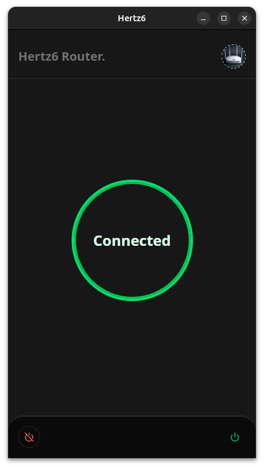
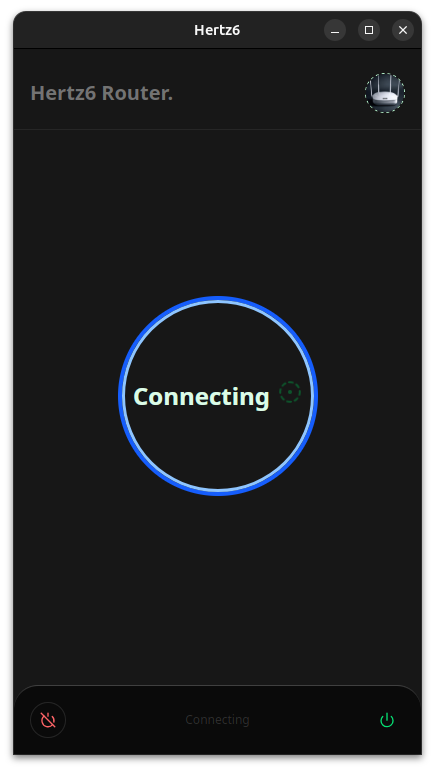
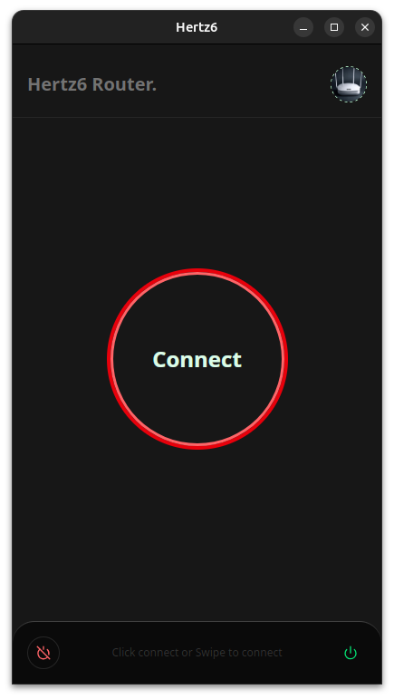

# Router Control App

## Overview

Router Control App is a simple interactive mobile application designed to manage and monitor your home router. The app aims to provide all the features available in the router's native web interface while extending functionality with additional features powered by the router's server API.

## Features (Planned)

- **Full Router Interface Access**: Control all available settings provided by the router's native interface.
- **Device Monitoring & Management**: Track connected devices and manage network access.
- **Alerts & Notifications**: Receive alerts for specific actions, such as plugging/unplugging the router (useful for routers without warning lights).
- **Client Blacklisting**: Easily blacklist or whitelist clients.
- **Automated Tasks**: Enable automatic updates and scheduled reboots.
- **Data Usage Analytics**: Monitor data usage per hour.
- **Advanced Web Usage Analytics**: View website organization-based analytics and control browsing permissions.
- **Remote Access**: Securely access and control the router over the internet.

## Current Progress

- **Authentication Screen**: The initial setup for authenticating with the router's API has been implemented.
- Images:
  
  
  

## Future Enhancements

- **Integration with IoT Devices**: Expand support to manage connected IoT devices.
- **Advanced Security Features**: Implement more security controls for better protection.
- **Custom User Profiles**: Provide customizable user access levels and permissions.

## Installation & Usage

_(To be added as development progresses)_

## Contributing

Contributions are welcome! If you have ideas or want to contribute, feel free to create an issue or submit a pull request.

## License

_(Specify license here, e.g., MIT, GPL, etc.)_
